 

SAME51 IGaT Legato Showcase RTOS
-------------------------

Defining the Architecture
-------------------------

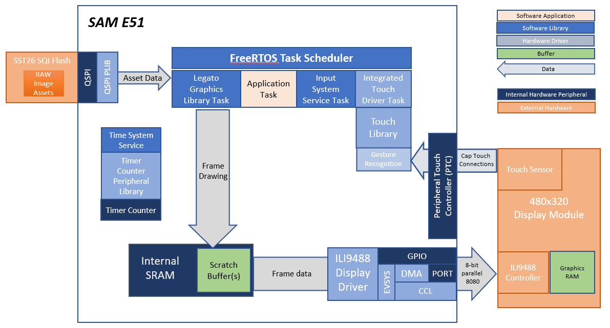

This application showcases the capabilities of the SAME51 Integrated Graphics and Touch Development Kit.
The SAM E51 Integrated Graphics and Touch Development Kit is a low-cost reference design for HMI applications
using the SAME5x/D5x MCU for running both the graphics and touch functions in a single MCU. It features a 
480x320 HVGA Smart Display module with a Capacitive Touch Sensor Overlay.

The graphics function uses the Legato Harmony Graphics library and display driver to deliver the UI frames to
a smart display module thru an 8-bit parallel 8080 interface. This interface is driven from the MCU using a 
combination of the DMA, EVSYS, CCL and GPIO peripherals. 

The touch function uses the on-chip Peripheral Touch Controller (PTC) peripheral to acquire touch sensor information
from the Capacitive Touch Sensor. The Touch Sensor is connected to the PTC thru a 7x5 channel interface.

This demonstration also uses RAW images stored in the external SQI flash for the images on UI screens.

This demonstration runs FreeRTOS, and all major software functions are executed as FreeRTOS tasks. FreeRTOS is configured
to collect information on the amount of processing time used by each these tasks. The demonstration can be enabled to print
this information on the screen and the serial debug interface. 

### Demonstration Features 

* Legato Graphics Library 
* Peripheral Touch Controller, 2D Touch Library with Basic Gestures
* Advanced Gestures Detection using the [Motion Gestures](https://motiongestures.com/) library
* Input system service and Integrated Touch Driver
* Time system service, timer-counter peripheral library and driver 
* ILI9488 display 8-bit parallel mode driver (DMA-CCL boosted) 
* 16-bit RGB565 color depth (8-bit palettized double buffering) 
* Port/GPIO peripheral 
* SST26 QSPI driver 
* External Image assets stored in external SQI Flash
* FreeRTOS
* Run-time task processing time information

Creating the Project Graph
--------------------------

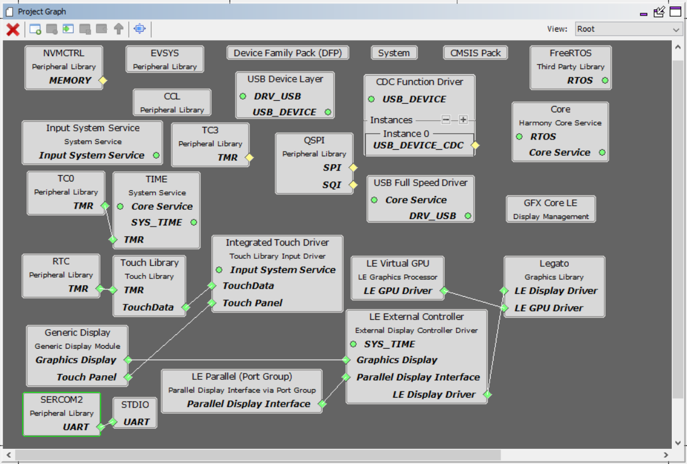

The MHC configuration for this project is unique to the SAM E51 IGaT Development Kit Hardware. To create a
duplicate project configuration, use the MHC import function to import the IGaT MHC configuration in
"legato_igat_showcase\firmware\src\config\ili9488_rgb565_e51_igat_rtos\ili9488_rgb565_e51_igat_rtos.mhc".

Building the Application
------------------------

The parent directory for this application is apps/legato_igat_showcase. To build this application, use MPLAB X IDE to open the apps\legato_igat_showcase\firmware\legato_sc_e51_igat_rtos.X project file.

The following table lists configuration properties:

| Project Name  | BSP Used |Graphics Template Used | Description |
|---------------| ---------|---------------| ---------|
| legato_sc_e51_igat_rtos.X | None | None| SAM E51 Integrated Graphics and Touch Development Kit |

> \*\*\_NOTE:\_\*\* This application may contain custom code that is marked by the comments // START OF CUSTOM CODE ... and // END OF CUSTOM CODE. When using the MPLAB Harmony Configurator to regenerate the application code, use the "ALL" merging strategy and do not remove or replace the custom code.

Configuring the Hardware
--------------------------

This section describes how to configure the supported hardware. 

Configure the hardware as follows: 

* Connect a USB cable from the host computer to the DEBUG USB port on the SAM E51 Integrated Graphics and Touch Development Kit. This USB connection is used for code download and debugging. 

The final hardware setup should be: 

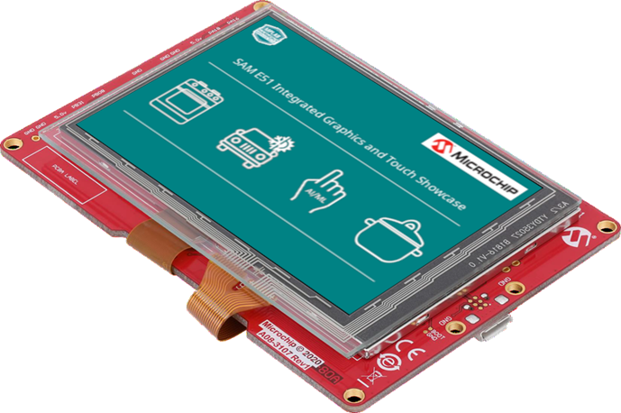

Updating the Graphics Assets in SQI Flash 
-----------------------------------------

The SAME51 Integrated Graphics and Touch board comes pre-programmed with the Showcase demo. The SQI flash is also pre-programmed with the image assets needed to run the demo.

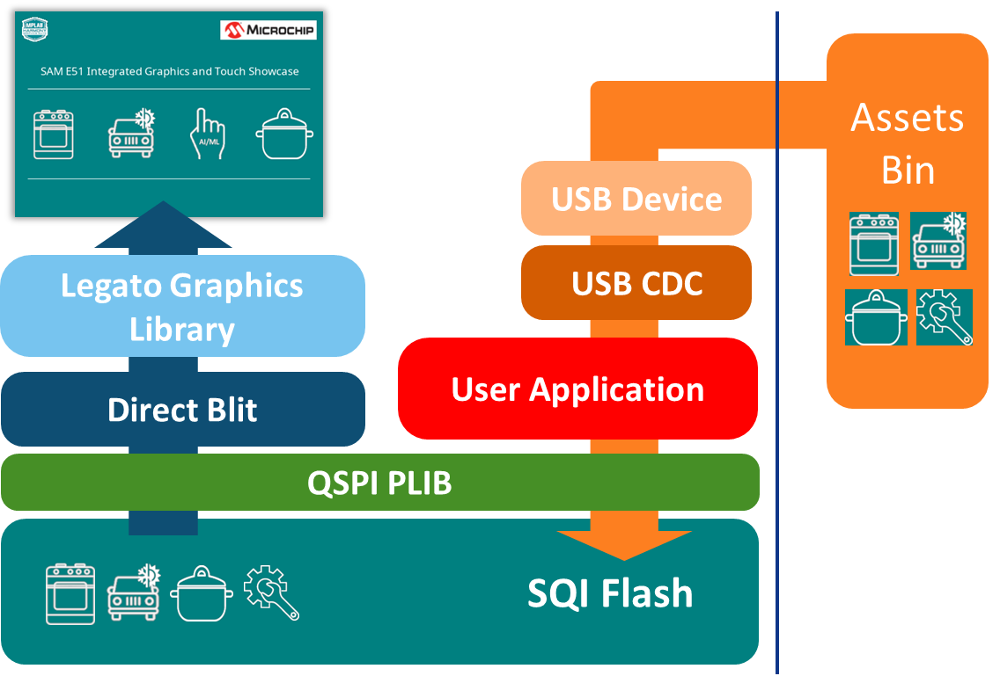

The SQI flash may need to be re-programmed if the external image assets get corrupted or if a new version of the Showcase demo requires new image assets. 

This section provides the steps on how to update firmware and the SQI Flash image on the SAME51 IGaT Curiosity board for the IGaT Showcase demo application.

This process requires a PC with a serial terminal application like [TeraTerm](https://ttssh2.osdn.jp/index.html.en) and 2 micro-USB cables to connect the board’s debug and target USB ports to the PC.

**Connect the board to the PC**

1. Debug USB connection to Host PC for Firmware Updates and Virtual COM Port for Serial Debug
1. Target USB connection for SQI Flash image update

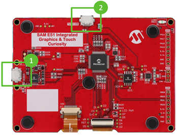

**Getting to the Application Setup**

SQI Flash Update process can be started from the Application Setup Screen. There are two ways to get to the Application Setup Screen:

1. Reboot, and tap the bottom part of the Intro Splash Screen during boot **, or
1. Tap the Setup button on the Menu Screen

** use this method if the buttons on the Menu Screen do not show up properly due to missing or incompatible SQI Flash image

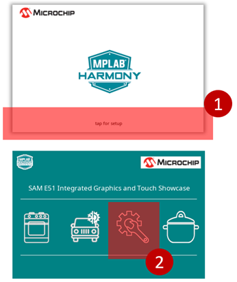

**Starting the SQI Flash Update**

1. On the Application Setup screen, touch the “Erase & Update” button
1. Touch “Yes” to Erase the SQI Flash and wait for the Host PC to send the binary file

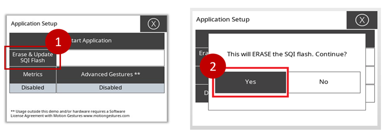

**Downloading the SQI Flash Image**

On the Host PC, download and install the TeraTerm application.

1. Launch TeraTerm and start a New Connection  
2. Select Serial -> COMx: USB Serial Port**  
3. Go to File -> Send File to select the file to send  
4. Select the SQI Flash binary file QSPI_IMG.bin**  
	a. Make sure “Binary” Option is checked (***very important***)  	
	b. Click Open to continue

_** QSPI_IMG.bin can be copied from apps\legato_igat_showcase\firmware\src\config\ili9488_rgb565_e51_igat\.legato_generate_cache.zip_

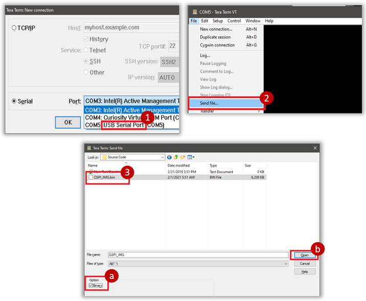

**Completing the SQI Flash Update**

Download progress is shown in TeraTerm, and in the application  

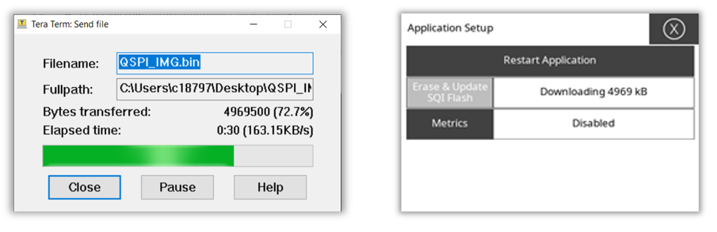

1. TeraTerm dialog box will close when download is complete.
1. Tap “Restart Application” to restart the application with the new SQI Flash binary

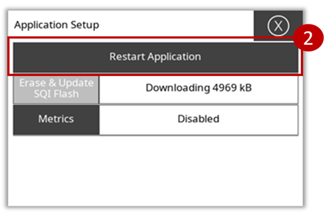

Running the Demonstration
--------------------------

When power-on is successful, the application will show a splash screen and then the menu screen.

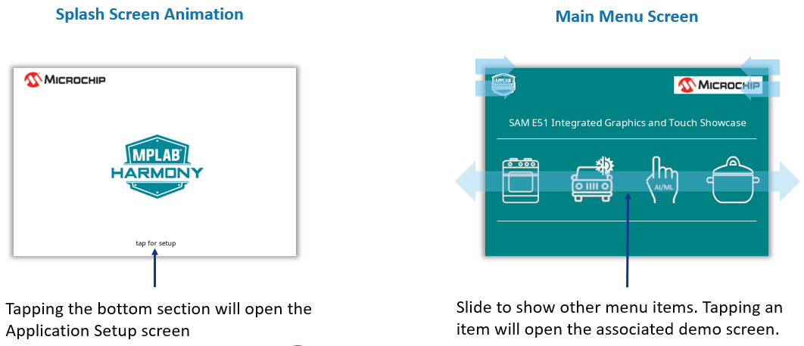

Tapping on any of the menu icons will open the various demonstration screens. Each screen is interactive, and basic gestures like two-finger swipe can be used to move between screens.

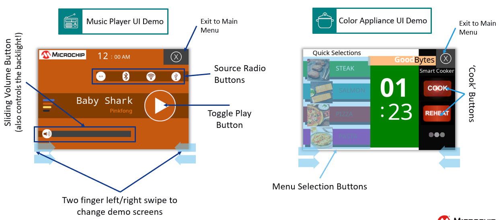
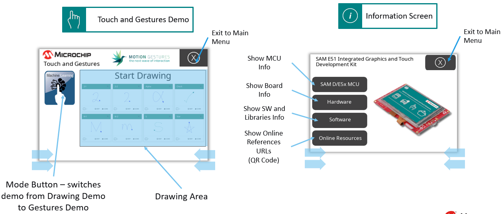
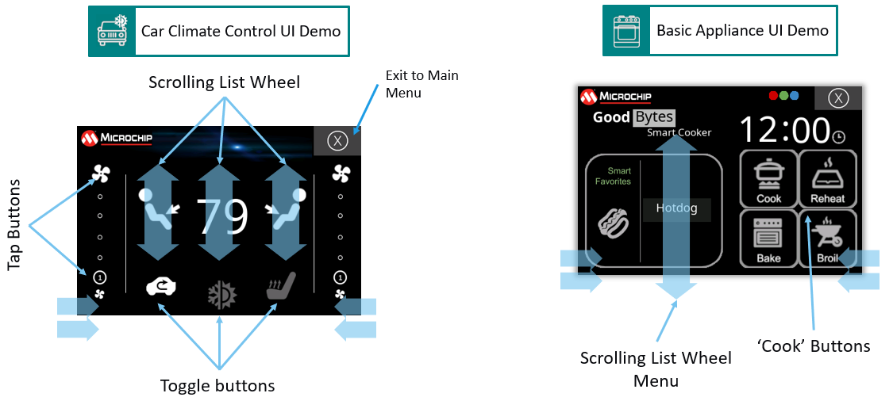

The Application Setup page provides controls for enabling metrics, updating the the SQI flash and other global application settings like advanced gesture recognition.

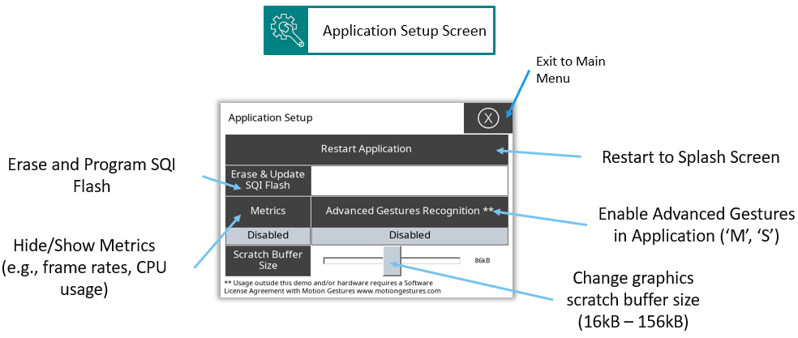

Active gesture recognition demonstrates basic gesture detection using the H3 Touch Library or Advanced Gestures using the [Motion Gestures](https://motiongestures.com/).

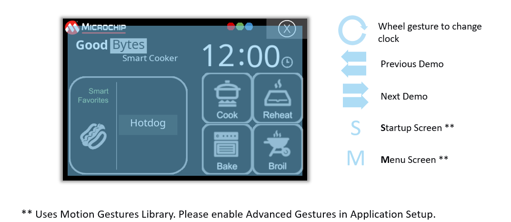

**Low Power Mode and Proximity Sensing**

The application will automatically enter low power mode after 30 seconds of inactivity. Low power mode can also be initiated by double-tapping the upper left corner of the display.

During low power mode, proximity detection is enabled and the application will exit low power mode when proximity or touch input is detected.

Application Metrics - Performance and CPU Usage
--------------------------

When 'Metrics' is enabled in the Application Setup Screen, the demo will provide real-time information about the performance and CPU resources used to perform the current user interface activity.

In the demonstrations screens, a label with the frame update rate and the total CPU processing used is shown and updated every second.

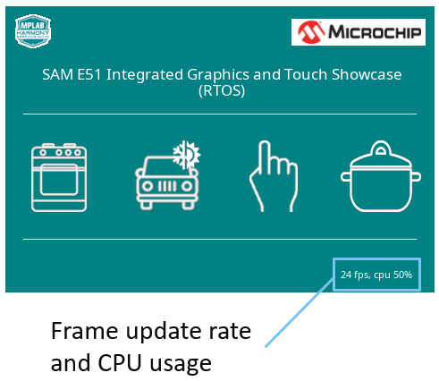

**Per Task CPU Usage Information via Serial Debug Output**

A more detailed, per task CPU usage information can be access thru the serial debug interface. To access this information, the board must be connected to a host PC via the USB debug port. 

A serial terminal PC application like TeraTerm or Putty must be configured and run to read the serial debug data from the board. Below is an example on how to configure TeraTerm.

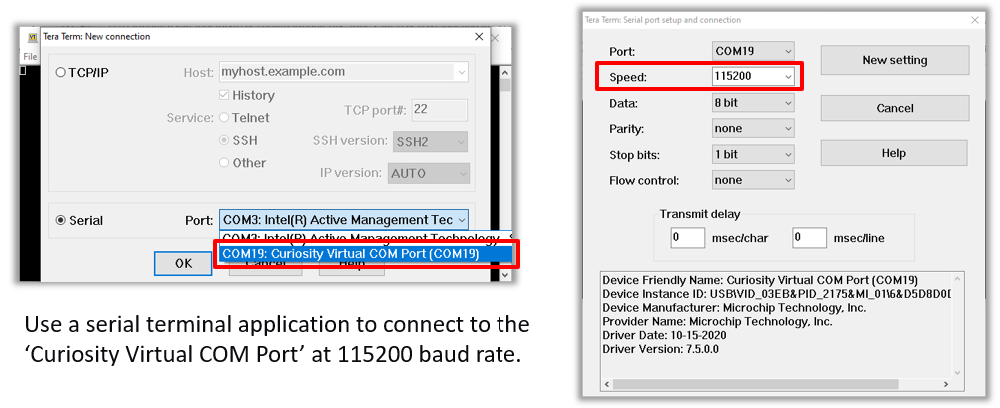

After the serial debug interface is configured, the CPU usage information would be shown on the serial terminal application. 

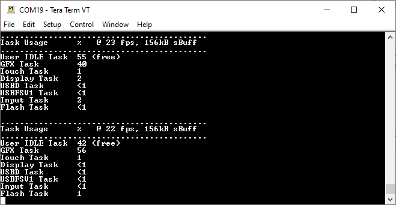

The example usage information above shows the CPU usage for each task with the application updating the UI at 22 - 23 frames per second, and with the maximimum 156kB graphics scratch buffer. Touch and Graphics are the main tasks involved in driving the user interface.

* GFX Task usage is the amount of CPU time used for updating and drawing the frames to the external display controller.
* Touch Task usage is percentage of CPU time used for processing the touch input and for running the gesture recognition library.

User IDLE Task shows the CPU processing time used for the user application task. This value can be interpreted as the remaining CPU processing time available to run tasks that may be needed for product-specific functions.

Graphics Memory and Scratch Buffer Usage
--------------------------

The Graphics Library uses scratch buffers to render sections of the frame internally before the updates are sent to the display. Having a large scratch buffer helps enhance performance and also minimize screen tearing. For more information about scratch buffers, refer to the [User's Guide]( https://github.com/mchpgfx/legato.docs/wiki/Adjusting-Scratch-Buffer-Size).

The size of the scratch buffer is set statically in the project. In this demonstration, however, custom code was added to be able to set at run-time how much of the pre-allocated scratch buffer will the library use. The purpose is to show users how the size of the scratch buffer can affect graphics performance and quality, so they can consider these tradeoffs when setting the scratch buffer size for their projects on the SAME51 IGaT platform.

To set the usable size of the scratch buffer, go to the Application Setup Screen and use the Slider Widget to adjust the size.

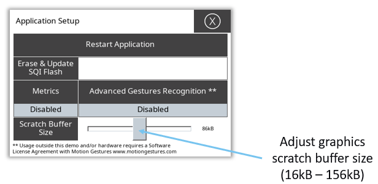

* * * * *
