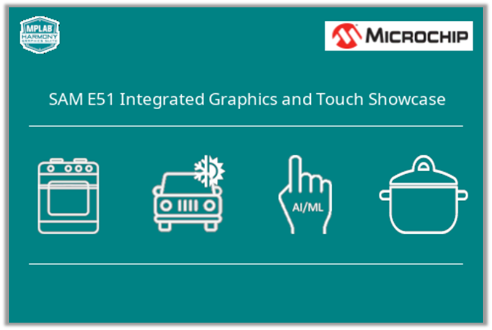

---
parent: Example Applications
title: Legato SAM E51 Integrated Graphics and Touch Showcase
nav_order: 1
---

# Legato SAM E51 Integrated Graphics and Touch Showcase

This is the showcase graphics demonstration on the SAME51 Integrated Graphics and Touch Development Board

|MPLABX Configuration|Board Configuration|
|:-------------------|:------------------|
| [legato_sc_e51_igat.X](firmware/legato_sc_e51_igat.X/readme.md)| [SAM E51 Integrated Graphics and Touch Development Board](https://www.microchip.com/developmenttools/ProductDetails/EV14C17A) |