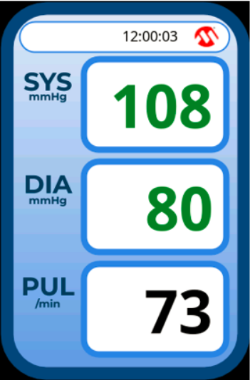

 legato_mn_e54_cult_cpro_parallel.X

Defining the Architecture
-------------------------

The application features user touch input through the integrated touch screen on the display panel. Touch input from the touch controller goes through the I2C port, and the Input System Service acquires the touch input information from the Touch and I2C drivers. The Input System Service sends touch events to the Graphics Library, which processes these events and updates the frame data accordingly. 

This configuration runs on the SAM E54 Curiosity Ultra board with a 24-bit passthrough GFX interface card and a maXTouch Curiosity Pro display. The maXTouch Curiosity Pro display has an ILI9488 display controller that is connected to the SAM E54 thru the port/GPIO peripheral using an 8-bit 8080/Parallel interface, boosted with a combination of DMA and CCL peripherals. The Legato graphics library draws the updated sections of the frame to an internal scratch buffer which is used by the ILI9488 display driver to update the ILI9488 display controller. 

User touch input on the display panel is received thru the PCAP capacitive touch controller, which sends a notification to the Touch Input Driver. The Touch Input Driver reads the touch information over I2C and sends the touch event to the Graphics Library thru the Input System Service. 

### Demonstration Features 

* Legato Graphics Library 
* Input system service and touch driver 
* Time system service, timer-counter peripheral library and driver 
* ILI9488 display 8-bit parallel mode driver (DMA-CCL boosted) 
* 16-bit RGB565 color depth (8-bit palettized double buffering) 
* Port/GPIO peripheral 
* I2C peripheral library and driver 
* Images and Fonts for user interface stored in internal flash 
* Alpha-blending 

Creating the Project Graph
--------------------------

The Project Graph diagram shows the Harmony components that are included in this application. Lines between components are drawn to satisfy components that depend on a capability that another component provides.

Adding the **SAM E54 Curiosity Ultra BSP** and **Legato Graphics w/ MXT Curiosity Pro Display** Graphics Template component into the project graph will automatically add the components needed for a graphics project and resolve their dependencies. It will also configure the pins needed to drive the external peripherals like the display and the touch controller.  

For the DMA-CCL boosted setup, components TC4, CCL needs to be added. 

Additional components to support File System, MSD Client Driver, USB Full Speed Driver, USB Host Layer, SDMMC, SDHC1, QSPI and SST26 needs to be added and connected manually. 

Some of these components are fine with default settings, while other require some changes. The following is a list of all the components that required custom settings. 

To setup the CCL to clock the pixel data, make sure PB09 is set to CCL_OUT2 

Instead of write strobe, make sure PB17 is setup as RSDC instead

Building the Application
------------------------

The parent directory for this application is apps/legato_monitor. To build this application, use MPLAB X IDE to open the apps/legato_monitor/firmware/legato_mn_e54_cult_xpro_parallel.X project file. 

The following table lists configuration properties:

| Project Name  | BSP Used |Graphics Template Used | Description |
|---------------| ---------|---------------| ---------|
| legato_mn_e54_cult_xpro_parallel.X | SAM E54 Curiosity Ultra BSP | Legato Graphics w/ maXTouch Curiosity Pro Display | SAM E54 Curiosity Ultra w/ maXTouch Curiosity Pro display via 8-bit parallel interface |

> \*\*\_NOTE:\_\*\* This application may contain custom code that is marked by the comments // START OF CUSTOM CODE ... and // END OF CUSTOM CODE. When using the MPLAB Harmony Configurator to regenerate the application code, use the "ALL" merging strategy and do not remove or replace the custom code.

Configuring the Hardware
--------------------------

This section describes how to configure the supported hardware. 

Configure the hardware as follows: 

* Attach the 24-bit pass through card to the GFX Connector on the SAM E54 Curiosity Ultra board. 
* Connect the ribbon cable from the maXTouch Curiosity Pro Display to the ribbon connector on the 24-bit pass through card. Make sure that the S1 switch on the 24-bit pass through card is set to 2. 
* On the backside of the maXTouch Curiosity Pro display, set the IM[2:0] switches to 011 for 8-bit MCU mode.

* Connect a USB cable from the host computer to the DEBUG USB port on the SAM E54 Curiosity Ultra board. This USB connection is used for code download and debugging. 
* Connect 5.5V power supply to the SAM E54 Curiosity Ultra board is optional 

The final hardware setup should be: 

Power up the board by connecting the power adapter to power connector or a powered USB cable to the DEBUG USB port on the board.

Running the Demonstration
--------------------------

When power-on is successful, the demonstration will first boot to a splash screen. After the splash screen, the main screen will be shown. If there is no touch input, the app will be in idle state and the main screen will show a running clock, and the rest of the labels will be blank (---). 

When the touched, simulated values for the blood pressure and pulse will be shown.  

* * * * *
