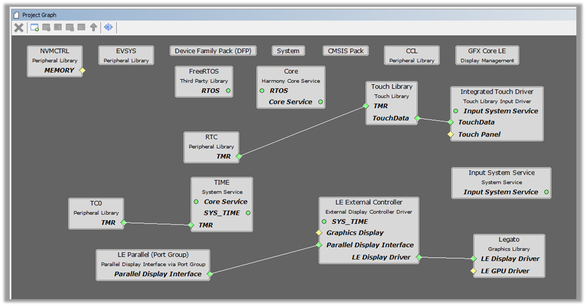

 

SAME51 IGaT Legato Quickstart
-----------------------------

Defining the Architecture
-------------------------

This is the quickstart application for the SAME51 Integrated Graphics and Touch Development Kit.
The SAM E51 Integrated Graphics and Touch Development Kit is a low-cost reference design for HMI applications
using the SAME5x/D5x MCU for running both the graphics and touch functions in a single MCU. It features a 
480x320 HVGA Smart Display module with a Capacitive Touch Sensor Overlay.

The graphics function uses the Legato Harmony Graphics library and display driver to deliver the UI frames to
a smart display module thru an 8-bit parallel 8080 interface. This interface is driven from the MCU using a 
combination of the DMA, EVSYS, CCL and GPIO peripherals. 

The touch function uses the on-chip Peripheral Touch Controller (PTC) peripheral to acquire touch sensor information
from the Capacitive Touch Sensor. The Touch Sensor is connected to the PTC thru a 7x5 channel interface.

### Demonstration Features 

* Legato Graphics Library
* Peripheral Touch Controller and 2D Touch Library 
* Input system service and Integrated Touch Driver
* Time system service, timer-counter peripheral library and driver 
* ILI9488 display 8-bit parallel mode driver (DMA-CCL boosted) 
* 16-bit RGB565 color depth (8-bit palettized double buffering) 
* Port/GPIO peripheral

Creating the Project Graph
--------------------------

The MHC configuration for this project is unique to the SAM E51 IGaT Development Kit Hardware. To create a
duplicate project configuration, use the MHC import function to import the IGaT MHC configuration in
"legato_quickstart\firmware\src\config\ili9488_rgb565_e51_igat\ili9488_rgb565_e51_igat.mhc".

Building the Application
------------------------

The parent directory for this application is apps/legato_quickstart. To build this application, use MPLAB X IDE to open the apps/legato_quickstart/firmware/legato_qs_e51_igat.X project file. 

The following table lists configuration properties: 

| Project Name  | BSP Used |Graphics Template Used | Description |
|---------------| ---------|---------------| ---------|
| legato_qs_e51_igat.X | None | None| SAM E51 Integrated Graphics and Touch Development Kit |

> \*\*\_NOTE:\_\*\* This application may contain custom code that is marked by the comments // START OF CUSTOM CODE ... and // END OF CUSTOM CODE. When using the MPLAB Harmony Configurator to regenerate the application code, use the "ALL" merging strategy and do not remove or replace the custom code.

Configuring the Hardware
------------------------

This section describes how to configure the supported hardware. 

Configure the hardware as follows: 

* Connect a USB cable from the host computer to the DEBUG USB port on the SAM E51 Integrated Graphics and Touch Development Kit. This USB connection is used for code download and debugging. 

The final setup should be: 

Running the Demonstration
-------------------------

When power-on is successful, the demonstration will display a similar menu to that shown in the following figure (different configurations may have slight variation in the screen aspect ratio.

* * * * *
