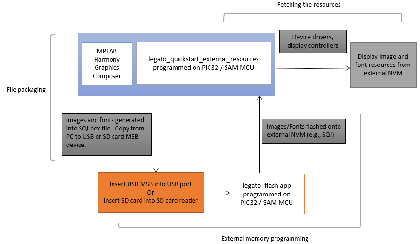

# Legato Quickstart External Resource

The legato_quickstart_external_resources (external flash reader) application demonstrates reading multiple images, multi-lingual strings and multiple font assets from both internal and external non-volatile memory (NVM).  The external resources are pre-programmed into the NVM using the legato_flash demonstration application.
The intent of legato_quickstart_external_resources (external flash reader) application is to demonstrate Legato Graphics Library’s ability to support assets stored on external NVM.  Another intent is to highlight possible draw performance drawbacks with these techniques and to serve as a guiding post for UI application designers on their judicious use.

Refer to [legato_flash](../legato_flash/readme.md) for external NVM programming information.

Applications requiring multiple images or non-alphabet-based languages with large number of glyphs, have a very large NVM requirement for their graphics resources.   In such applications, storing these graphics resources on-chip may be inefficient or impossible.  The solution is to store the graphics resources to off-chip NVM, thereby preserving the on-chip NVM for program memory and allowing for more complex functional features.

The legato_quickstart_external_resources (external flash reader) application populates some of its user interface from assets stored on on-chip NVM and other parts of it from assets stored as binary data on an external NVM.   The resources are previous copied into the external NVM using the legato_flash application.

To demonstrate how to access graphics resources stored on an external memory device, three components are needed:

* File Packaging 
* Bootloader Application 
* Fetch Application 

The following figure shows the external resources process diagram.

|MPLABX Configuration|Board Configuration|
|:-------------------|:------------------|
| [legato_qs_x_r_e54_cult_cpro_parallel.X](firmware/legato_qs_x_r_e54_cult_cpro_parallel.X/readme.md) | [SAM E54 Curiosity Ultra Development Board](https://www.microchip.com/Developmenttools/ProductDetails/DM320210) with a 24-bit passthrough GFX interface card and a [maXTouch Curiosity Pro Extension Kit](https://www.microchip.com/Developmenttools/ProductDetails/ATMXT-XPRO) |