 

Legato Showcase Plus
-------------------------

Defining the Architecture
-------------------------

The block diagrams below show the various software and hardware blocks used in this application.

The **Legato Showcase Plus** application uses the Legato Graphics Library to render graphics to the [maXTouch Curiosity Pro Display](https://www.microchip.com/Developmenttools/ProductDetails/AC320007). 

The graphics function uses the Legato Harmony Graphics library and display driver to deliver the UI frames to
a smart display module thru an 8-bit parallel 8080 interface. This interface is driven from the MCU using a 
combination of the DMA, EVSYS, CCL and GPIO peripherals. 

The application also features user touch input through the integrated touch screen on the display panel. Touch input from the touch controller goes through the I2C port, and the Input System Service acquires the touch input information from the Touch and I2C Drivers. The Input System Service sends touch events to the Graphics Library, which processes these events and updates the frame data accordingly.

Finally, the application uses the Timer System Service and driver to send timer events for transitioning images in the Slideshow Demo at specified intervals.

User touch input on the display panel is received thru the PCAP capacitive touch controller, which sends a notification to the Touch Input Driver. The Touch Input Driver reads the touch information over I2C and sends the touch event to the Graphics Library thru the Input System Service.

This demonstration also uses RAW images stored in the external SQI flash for the images on UI screens.

### Demonstration Features 

* Legato Graphics Library 
* Input system service and maXTouch Controller Driver
* Time system service, timer-counter peripheral library and driver 
* ILI9488 display 8-bit parallel mode driver (DMA-CCL boosted) 
* 16-bit RGB565 color depth (8-bit palettized double buffering) 
* Port/GPIO peripheral 
* QSPI PLIB with XIP mode
* USB Full Speed Driver
* USB CDC Functions
* External Image assets stored in external SQI Flash

Creating the Project Graph
--------------------------

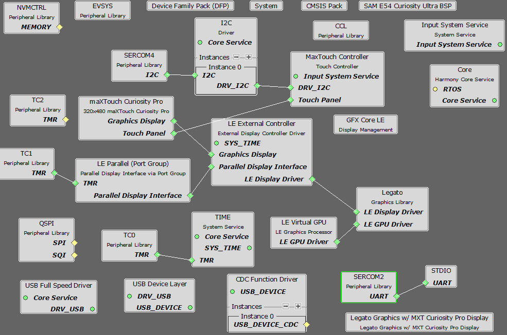

The MHC configuration for this project is unique to the SAM E54 Curiosity Ultra Development Board. To create a
duplicate project configuration, use the MHC import function to import this application's MHC configuration in
"legato_showcase_plus\firmware\src\config\ili9488_rgb565_e54_cult_parallel\ili9488_rgb565_e54_cult_parallel.mhc".

Building the Application
------------------------

The parent directory for this application is apps/legato_showcase_plus. To build this application, use MPLAB X IDE to open the apps\legato_showcase_plus\firmware\legato_scp_e54_cu_cpro_parallel.X project file.

The following table lists configuration properties:

| Project Name  | BSP Used |Graphics Template Used | Description |
|---------------| ---------|---------------| ---------|
| legato_sc_e54_cult_xpro_parallel.X | SAM E54 Curiosity Ultra BSP | Legato Graphics w/ maXTouch Curiosity Pro Display | SAM E54 Curiosity Ultra w/ maXTouch Curiosity Pro display via 8-bit parallel interface |

> \*\*\_NOTE:\_\*\* This application may contain custom code that is marked by the comments // START OF CUSTOM CODE ... and // END OF CUSTOM CODE. When using the MPLAB Harmony Configurator to regenerate the application code, use the "ALL" merging strategy and do not remove or replace the custom code.

Configuring the Hardware
--------------------------

This section describes how to configure the supported hardware. 

Configure the hardware as follows: 

* Attach the 24-bit pass through card to the GFX Connector on the SAM E54 Curiosity Ultra board. 
* Connect the ribbon cable from the maXTouch Curiosity Pro Display to the ribbon connector on the 24-bit pass through card. Make sure that the S1 switch on the 24-bit pass through card is set to 2. 
* On the backside of the maXTouch Curiosity Pro display, set the IM[2:0] switches to **011** for 8-bit MCU mode. 

* Connect a USB cable from the host computer to the DEBUG USB port on the SAM E54 Curiosity Ultra board. This USB connection is used for code download and debugging. 
* Connect 5.5V power supply to the SAM E54 Curiosity Ultra board is optional 

The final hardware setup should be: 

Updating the Graphics Assets in SQI Flash 
-----------------------------------------

This application requires pre-programmed image assets stored on SQI flash.

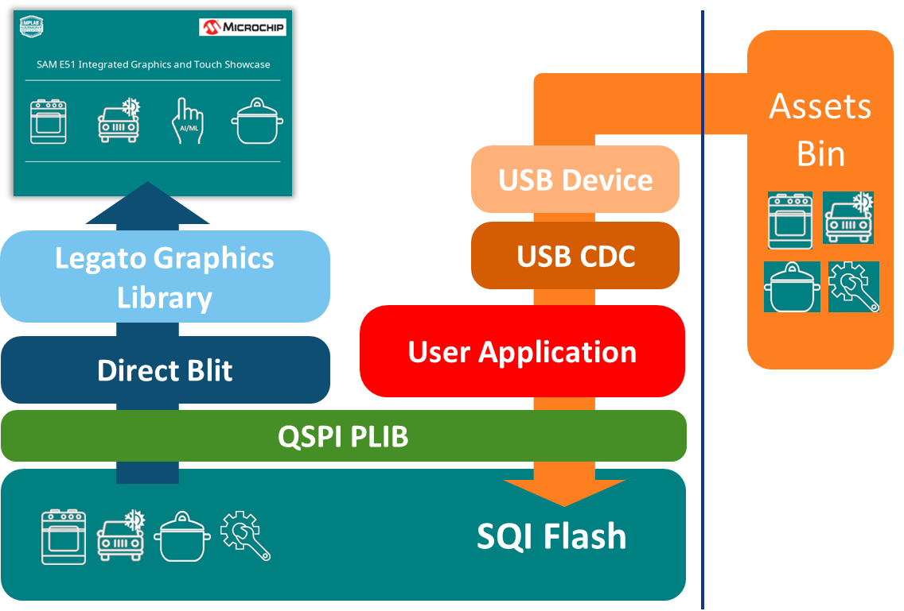

This section provides the steps on how to update firmware and the SQI Flash image on the SAM E54 Curiosity Ultra Development Board.

This process requires a PC with a serial terminal application like [TeraTerm](https://ttssh2.osdn.jp/index.html.en) and 2 micro-USB cables to connect the board’s debug and target USB ports to the PC.

**Connect the board to the PC**

1. Debug USB connection to Host PC for Firmware Updates
2. Target USB connection for SQI Flash image update

**Getting to the Application Setup**

SQI Flash Update process can be started from the Application Setup Screen. There are two ways to get to the Application Setup Screen:

1. Reboot, and tap the bottom part of the Intro Splash Screen during boot **, or
2. Tap the Setup button on the Menu Screen

** use this method if the buttons on the Menu Screen do not show up properly due to incorrect SQI Flash image

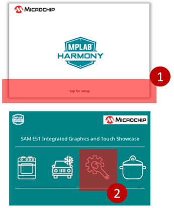

**Starting the SQI Flash Update**

1. On the Application Setup screen, touch the “Erase & Update” button
1. Touch “Yes” to Erase the SQI Flash and wait for the Host PC to send the binary file

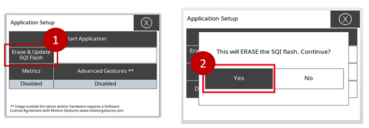

**Downloading the SQI Flash Image**

On the Host PC, download and install the TeraTerm application.

1. Launch TeraTerm and start a New Connection  
2. Select Serial -> COMx: USB Serial Port**  
3. Go to File -> Send File to select the file to send  
4. Select the SQI Flash binary file QSPI_IMG.bin**  
	a. Make sure “Binary” Option is checked (***very important***)  	
	b. Click Open to continue

_** QSPI_IMG.bin can be copied from apps\legato_igat_showcase\firmware\src\config\ili9488_rgb565_e51_igat\.legato_generate_cache.zip_

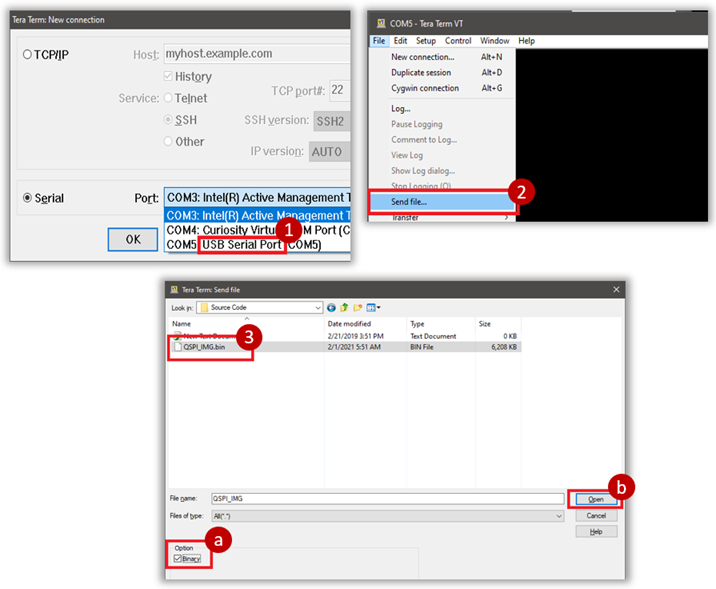

**Completing the SQI Flash Update**

Download progress is shown in TeraTerm, and in the application  

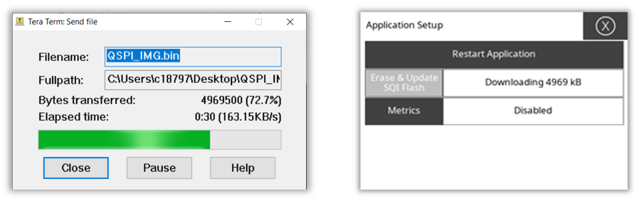

1. TeraTerm dialog box will close when download is complete.
1. Tap “Restart Application” to restart the application with the new SQI Flash binary

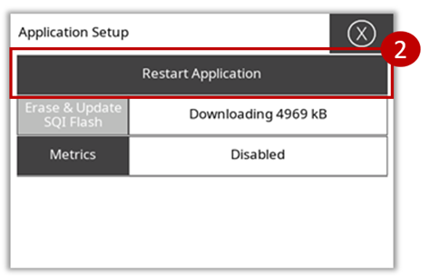

Running the Demonstration
--------------------------

When power-on is successful, the application will show a splash screen and then the menu screen.

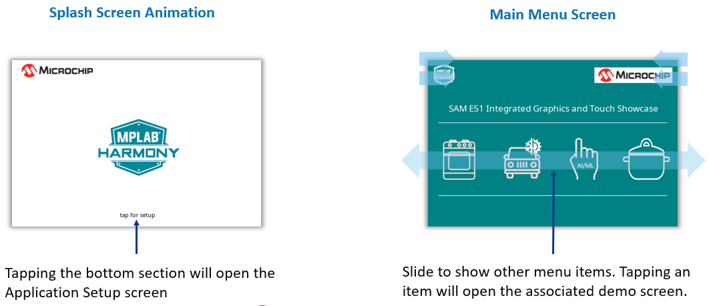

Tapping on any of the menu icons will open the various demonstration screens. Each screen is interactive, and basic gestures like two-finger swipe can be used to move between screens.

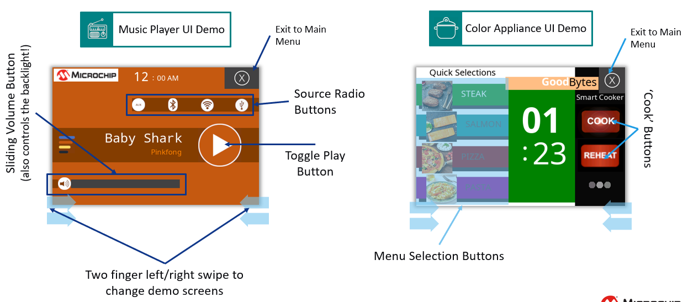
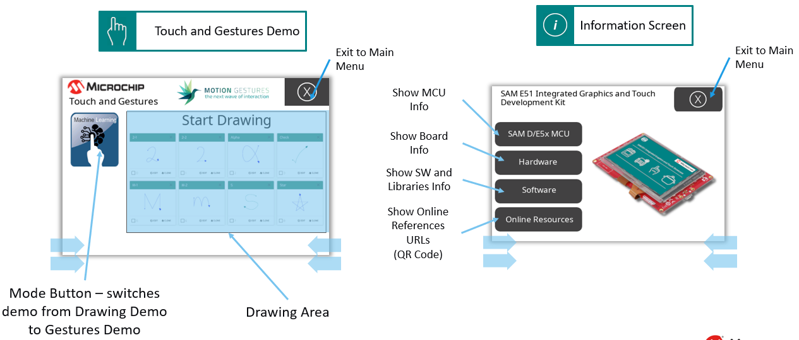
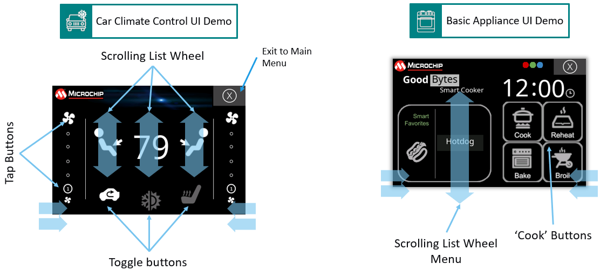

The Application Setup page provides controls for enabling metrics, updating the the SQI flash.

* * * * *
