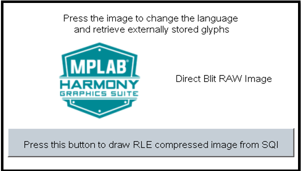

# Example Applications

The following applications are provided to demonstrate both basic and advanced Graphics capabilities of the SAM E54 Family.

## Legato Library Examples 

* [Legato IGAT Showcase](./legato_igat_showcase/readme.md)

This is the showcase graphics demonstration on the [SAM E51 Integrated Graphics and Touch Development Board](https://www.microchip.com/developmenttools/ProductDetails/EV14C17A)

* [Legato Showcase Plus](./legato_showcase_plus/readme.md)

This is the showcase graphics demonstration on the [SAM E54 Curiosity Ultra Development Board](https://www.microchip.com/Developmenttools/ProductDetails/DM320210)

* [Legato Quickstart](./legato_quickstart/readme.md)

This demonstration provides a touch-enabled starting point for the legato graphics library.

* [Legato Flash](./legato_flash/readme.md)

The legato_flash demonstration application serves as an external memory programmer to flash the off-chip non-volatile memory.

* [Legato Quickstart External Resource](./legato_quickstart_ext_res/readme.md)

This demonstration provides a touch-enabled starting point for reading images, string, and multiple fonts from both internal and external non-volatile memory (NVM).

* [Legato Showcase](./legato_showcase/readme.md)

This demonstration provides a touch-enabled starting point for reading images, string, and multiple fonts from both internal and external non-volatile memory (NVM).

* [Legato Benchmark](./legato_benchmark/readme.md)

This application shows the frame update rates for various operations in the graphics library, including string rendering, area fills, and image decode and rendering. 

## Blank Library Examples

* [Blank Quickstart](./blank_quickstart/readme.md)

This demonstration provides a starting point to integrate a third-party graphics library with MPLAB Harmony Graphics Suite.

## LVGL Library Examples

* [LVGL Showcase](./lvgl_showcase/readme.md)

This application demonstrates a simple way to create and run a graphics application using the LVGL graphics library.

