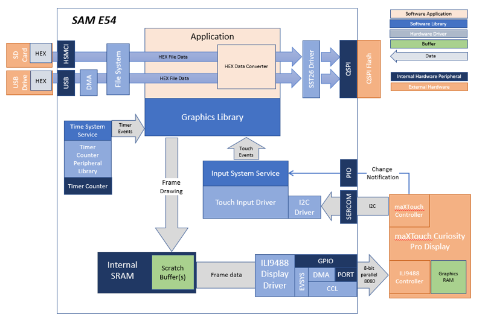
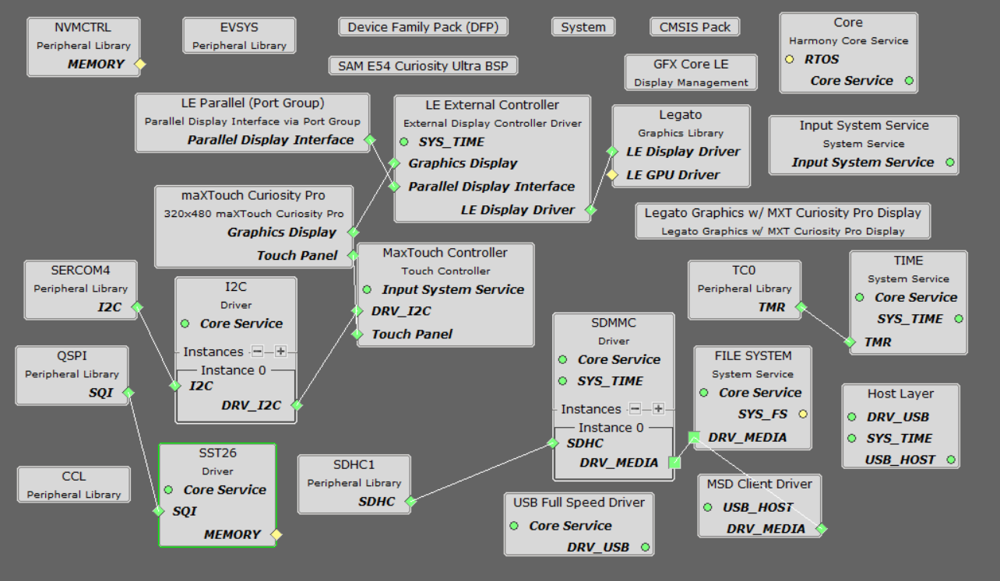
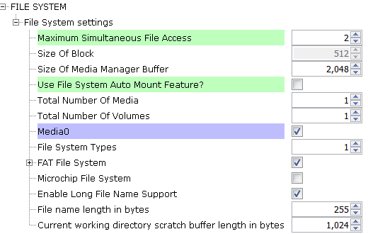
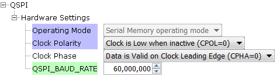
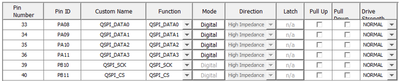
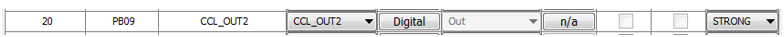
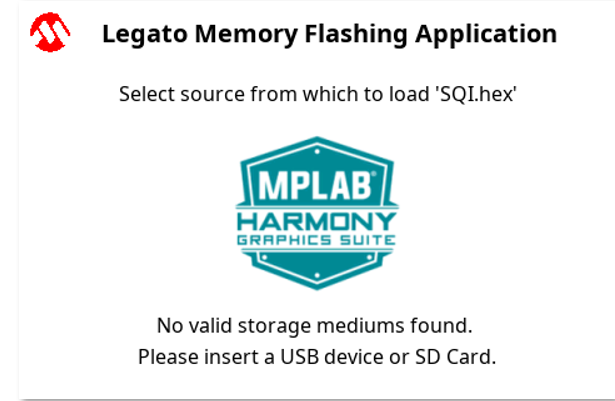
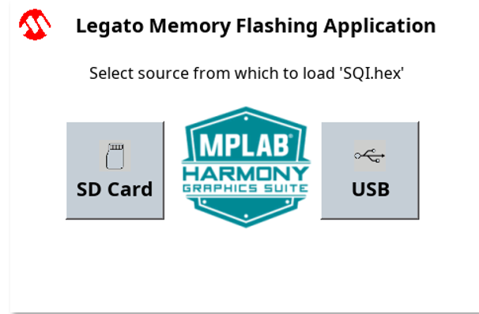
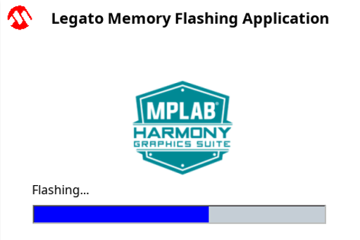

 legato_fl_e54_cult_cpro_parallel.X

Defining the Architecture
-------------------------

This application uses the file systems in MPLAB Harmony and the USB or the SDMMC
driver to scan the MSD for a .hex file with resources and reads them
sector by sector and programs the external non-volatile QSPI memory. The
Graphics Library is used to render graphics to the scratch buffer. Via
the ILI9488 Display Driver, boosted with a combination of DMA and CCL
peripherals, scratch buffer data is transferred out to the ILI9488
controller via 8-bit parallel in 8080 mode.

The application also features user touch input through the integrated
touch screen on the display panel. Touch input from the touch controller
goes through the I2C port, and the Input System Service acquires the
touch input information from the Touch and I2C drivers. The Input
System Service sends touch events to the Graphics Library, which
processes these events and updates the frame data accordingly.

This configuration runs on the SAM E54 Curiosity Ultra board with a
24-bit passthrough GFX interface card and a maXTouch Curiosity Pro
display. The maXTouch Curiosity Pro display has an ILI9488 display
controller that is connected to the SAM E54 thru the port/GPIO
peripheral using an 8-bit 8080/Parallel interface, boosted with
a combination of DMA and CCL peripherals. The Legato graphics library
draws the updated sections of the frame to an internal scratch buffer
which is used by the ILI9488 display driver to update the ILI9488
display controller.

User touch input on the display panel is received thru the PCAP
capacitive touch controller, which sends a notification to the Touch
Input Driver. The Touch Input Driver reads the touch information over
I2C and sends the touch event to the Graphics Library thru the Input
System Service.

The USB and the SDMMC peripheral are setup in MSD Host mode with the File System
service support. It scans for a file named SQI.hex when a UBS MSD or a SDMMC MSD
device is connected. The application reads the hex data from the
file and decodes it with a hex decoder into binary data. The binary
is written to external non-volatile memory via the QSPI peripheral
configured with the SST26 driver.

### Demonstration Features 

* Legato Graphics Library 
* Input system service and touch driver 
* Time system service, timer-counter peripheral library and driver 
* ILI9488 display 8-bit parallel mode driver (DMA-CCL boosted) 
* 16-bit RGB565 color depth (8-bit palettized double buffering) 
* Port/GPIO peripheral 
* I2C peripheral library and driver 
* SST26 QSPI driver 
* SDMMC driver
* USB MSD driver
* Images and Fonts for user interface stored in internal flash

Creating the Project Graph
--------------------------

To create a duplicate project configuration, use the MHC import function to import this application's MHC configuration in
"legato_flash\firmware\src\config\ili9488_rgb565_e54_cult_parallel\ili9488_rgb565_e54_cult_parallel.mhc".

Alternatively, here is the step-by-step guide to creating the project configuration.

Add the **SAM E54 Curiosity Ultra BSP** and **Legato Graphics w/ MXT Curiosity Pro Display** Graphics Template component into the project graph.

This will automatically add the components needed for a graphics project and resolve their dependencies. It will also configure the pins needed to drive the external peripherals like the display and the touch controller. 

For the DMA-CCL boosted setup, components TC4, CCL needs to be added. 

Additional components to support File System, SDMMC, SDHC1, QSPI and SST26 needs to be added and connected manually. 

Some of these components are fine with default settings, while other require some changes. The following is a list of all the components that required custom settings. 

For QSPI access, make sure all 7 pins for QSPI is mapped.

To setup the CCL to clock the pixel data, make sure PB09 is set to CCL_OUT2 

Instead of write strobe, make sure PB17 is setup as RSDC instead

Building the Application
------------------------

The parent directory for this application is apps/legato_flash. To build this application, use MPLAB X IDE to open the apps/legato_flash/firmware/legato_fl_e54_cult_cpro_parallel.X project file.

The following table lists configuration properties:

| Project Name  | BSP Used |Graphics Template Used | Description |
|---------------| ---------|---------------| ---------|
| legato_fl_e54_cult_cpro_parallel.X | SAM E54 Curiosity Ultra BSP | Legato Graphics w/ maXTouch Curiosity Pro Display | SAM E54 Curiosity Ultra w/ maXTouch Curiosity Pro display via 8-bit parallel interface |

> \*\*\_NOTE:\_\*\* This application may contain custom code that is marked by the comments // START OF CUSTOM CODE ... and // END OF CUSTOM CODE. When using the MPLAB Harmony Configurator to regenerate the application code, use the "ALL" merging strategy and do not remove or replace the custom code.

Configuring the Hardware
--------------------------

This section describes how to configure the supported hardware. 

Configure the hardware as follows: 

* Attach the 24-bit pass through card to the GFX Connector on the SAM E54 Curiosity Ultra board. 
* Connect the ribbon cable from the maXTouch Curiosity Pro Display to the ribbon connector on the 24-bit pass through card. Make sure that the S1 switch on the 24-bit pass through card is set to 2. 
* On the backside of the maXTouch Curiosity Pro display, set the IM[2:0] switches to **011** for 8-bit MCU mode. 

* Connect a USB cable from the host computer to the DEBUG USB port on the SAM E54 Curiosity Ultra board. This USB connection is used for code download and debugging. 
* Connect 5.5V power supply to the SAM E54 Curiosity Ultra board is optional 

For media stored on SDMMC device: 

* Connect a micro SDMMC card to the card slot on the bottom side of the board. This can be connected before or at any point before or after the application is powered-on.

The final hardware setup should be: 

Running the Demonstration
--------------------------

When power-on is successful, without an SD MMC device attached, the demonstration will display a screen with the message **No valid storage mediums found. Please insert an SD Card**:

If a valid SD MMC device is connected, the display will a SD button. LED2 (yellow) will light up also.

Make sure the SD MMC device has FAT32 file system format and a valid external resources file named precisely **SQI.hex** is copied inside.

Press and release the SD button on-screen. The application will initiate the data transfer on release of the button. Depending on the size of SQI.hex file (greater than 500 kilobytes), the application may freeze with no visual feedback, upwards of 30 seconds. It will then display a progress bar to indicate the transfer. The transfer completes when the progress bar is filled. The application will then display a button with **OK**.

* * * * *
