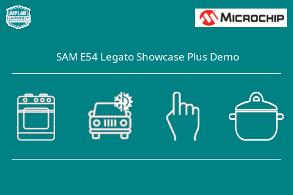

---
parent: Example Applications
title: Legato Showcase Plus
nav_order: 1
---

# Legato Showcase Plus

This is the showcase graphics demonstration on the SAM E54 Curiosity Ultra Development Board

|MPLABX Configuration|Board Configuration|
|:-------------------|:------------------|
| [legato_scp_e54_cu_cpro_parallel.X](firmware/legato_scp_e54_cu_cpro_parallel.X/readme.md)| [SAM E54 Curiosity Ultra Development Board](https://www.microchip.com/Developmenttools/ProductDetails/DM320210) |